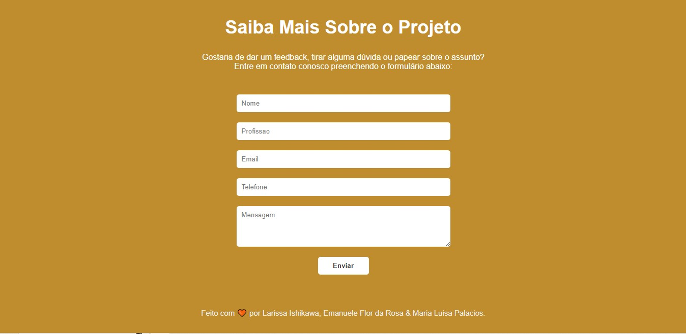

# ODS WEBSITE
#### Front-End Project 1  

##### Project built based on the Sustainable Development Goals (SDG), for the Front-End course.

Click [here](https://larissaiishikawa.github.io/ods-12/)  to access our GitHub Pages Website!
And click [here](https://github.com/larissaiishikawa/ods-12) to access our GitHub Repository ;)

## Technologies and Tools
- HTML
- CSS
- Javascript
- Figma
- Git & Github

### Do you have any feedbacks?
Please contact us! :D

**Larissa's Socials**
- [E-mail](mailto:l.ishikawacunha@gmail.com)
- [Linkedin](https://www.linkedin.com/in/larissaishikawacunha/)
- [GitHub](https://github.com/larissaiishikawa)  

**Emanuele's Socials**
- [E-mail](mailto:l.ishikawa@cunha)
- [Linkedin](https://www.linkedin.com/in/emanuele-flor-da-rosa-558762270/)
- [GitHub](https://github.com/emanueleflor) 

**Maria Luisa's Socials**
- [E-mail](mailto:marialuisappalacios@gmail.com)
- [Linkedin](https://www.linkedin.com/in/maria-lu%C3%ADsa-pal%C3%A1cios-9858a2247/)
- [GitHub](https://github.com/MisaneDev) 
  

###### Made with 🤍 by [LARISSA ISHIKAWA,](https://github.com/larissaiishikawa) [EMANUELE FLOR DA ROSA &](https://github.com/emanueleflor) [MARIA LUISA PALACIOS](https://github.com/MisaneDev)
